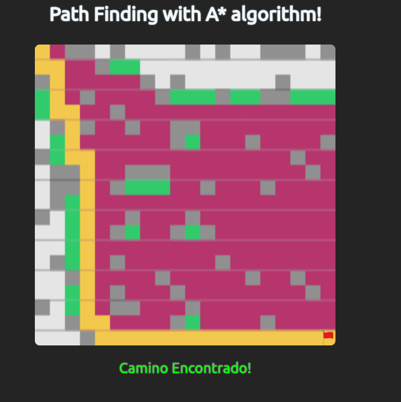

# MÉTODO DE BÚSQUEDA A*

<!-- insert the app screenshot here, with a link to the raw hosted image -->


## Descripción

El algoritmo de búsqueda A* es un algoritmo de búsqueda informada que se utiliza para encontrar el camino más corto entre dos nodos en un grafo. El algoritmo A* es una extensión del algoritmo de búsqueda de Dijkstra. El algoritmo A* utiliza una función de evaluación para determinar el siguiente nodo a visitar. La función de evaluación para el algoritmo A* es la suma de los costos de los nodos visitados hasta el momento y la estimación del costo del camino m0ás corto desde el nodo actual al nodo final.

## Getting Started

### Dependencies

* Se necesita tener node y npm instalados.

### Installing

Clonar el repositorio

```
git clone https://BrunoMont2003/pathfinding-visualizer.git
```

Instalar dependencias

```
npm install
```


### Executar el programa

Probar el programa de manera local

```
npm run dev
```

O visitar el siguiente link: https://path-finding-a.vercel.app/

## Autores

- Johan Castillo Oliva
- David Esparza Sánchez
- Bruno Espinosa Luna
- Bruno Montañez Díaz
- Benjamín Rojas Alza


## Agradecimientos

* [Javier Muñiz](https://github.com/javiermunizyt)